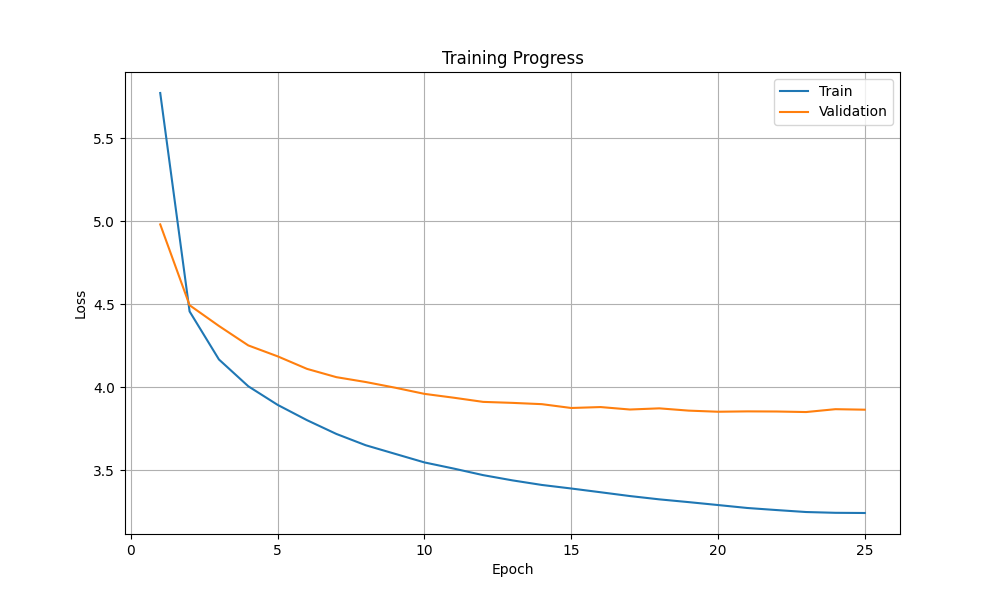

# pytorch-attention-is-all-you-need
Pytorch implementation of [[1706.03762] Attention Is All You Need](https://arxiv.org/abs/1706.03762).

Creating an English -> Spanish translator using sentence pairs from [Tatoeba](https://tatoeba.org/en/downloads).

## Results

Trained for 25 epochs on ~single GPU, the train/validation loss both improve until the validation loss plateaus around epoch 15.

<p align="left">
      
</p>

The absolute loss values are inflated by label smoothing, which is used in the paper to improve the model generalisation. Rather than training for 100% probability on the correct token like in normal cross-entropy loss, label smoothing teaches the model to stay slightly uncertain and only assign 90% probability to the correct token and spread the remaining 10% across the other tokens. This generalises better to real language problems.

The model reaches **22.5 BLEU** on a 500-sentence held-out test set.

| Source | Reference | Model output (greedy and beam) |
|---|---|---|
| The cat sat on the mat | El gato se sentó en la alfombra | El gato se sentó en la silla. |
| I love you | Te amo | Te quiero. |
| Where is the bathroom | Dónde está el baño | ¿Dónde está el baño? |
| She went to the store | Ella fue a la tienda | Ella fue a la tienda. |
| We are learning Spanish | Estamos aprendiendo español | Estamos aprendiendo español. |

 BLEU is the standard automatic metric for machine translation quality which measures how much a test translation overlaps with the target translation. It calculates the n-gram precision and combines them as a geometric mean, then it applies a brevity penalty so short outputs with 100% precision are penalised. For the held-out test result:

```
BLEU = 22.53   54.3/27.6/17.1/10.1 (BP = 1.000, ratio = 1.021)
```

**Geometric mean of the precisions** $p_1, \dots, p_4$:

$$\text{geomean} = \left( \prod_{n=1}^{4} p_n \right)^{1/4} = (0.543 \times 0.276 \times 0.171 \times 0.101)^{1/4} \approx 0.2255$$

**Brevity penalty**, where $c$ is the candidate length and $r$ the reference length:

$$BP = \begin{cases} 1 & \text{if } c > r \\ e^{(1 - r/c)} & \text{if } c \le r \end{cases}$$

Here $c = 3632 \ge r = 3556$, so $BP = 1.000$.

**Final score** (scaled to 0–100):

$$BLEU = BP \times \text{geomean} \times 100 = 1.000 \times 0.2255 \times 100 \approx 22.5$$

A good score requires performing well at every n-gram level, and although known limitation of BLEU is that it penalises correct alternatives such as "Te quiero" vs "Te amo" for "I love you" in our results, we have still done well here. 

The original paper scores 27.3–28.4 BLEU on English–German WMT 2014. Although scores across languages and datasets aren't directly comparable, the main limitation here is the smaller dataset of ~280k sentence pairs compared to the original's ~4.5M. The smaller dataset means we lack sufficient data to fully generalise for language translation (the upside being faster training runs that fit on a single GPU). One improvement might be to increase the number of acceptable reference translations to mitigate the penalty for correct alternatives.

## Getting Started 

1. For GPU, go to the [pytorch](https://pytorch.org/get-started/locally/) website and select the local installs to get the bash command.

2. To use this repo, [install uv](https://docs.astral.sh/uv/getting-started/installation/). Then to add torch to the project correctly we need to add the correct index url too.

```bash
uv add torch --index-url https://download.pytorch.org/whl/cu126
```

3. Now install dependencies.

```bash
uv sync
```

4. Download the English–Spanish sentence pairs from [Tatoeba](https://tatoeba.org/en/downloads) and place the TSV in `data/`, updating `DATA_PATH` in `src/config.py`.

5. Then train from scratch (set `TRAIN_MODEL = True` in `main.py`).

```bash
uv run python main.py
```

6. The best checkpoint (by validation loss) is saved to `checkpoints/` each time it improves, and a loss curve is written alongside it. To evaluate an existing checkpoint, set `TRAIN_MODEL = False` and run again.

7. During development check shape and understanding with the tests.

```bash
uv run pytest
uv run python smoke_test.py
```


## Development

This repo implements the transformer from scratch for understanding. In production you'd use `torch.nn.Transformer` (or `F.scaled_dot_product_attention`) for the fused, optimised kernels.

The most important takeaways from this implementation exercise are:
- Both padding and causal **masks** need to be the same return type (bool) and pass the device to the causal mask so it uses the same device as the model. The decoder uses a causal mask so each position attends only to itself and earlier tokens, never future ones.
- Simply using the 4000 steps from the paper's far larger dataset didn't scale to the smaller dataset and caused loss to plateau. Scaling the **warmup steps** to ~10% of the total training steps so the learning rate peaks and decays at the correct points fixed this.
-  **Tokenization** at the word level simply sets rare words to `<unk>` which heavily caps translation quality (or blows up the dataset size). SentencePiece BPE (Byte Pair Encoding) decomposes unseen words into known subword pieces, effectively eliminating `<unk>`. BPE iteratively replaces the most frequent pair of bytes with a new byte until the desired vocabulary size is reached e.g. if many words end in "er" (lower, higher, faster), the frequent 'e', 'r' pair gets merged into a single 'er' token.
- Since training takes compute and time, saving **checkpoints** is important for resuming training at various points.
- **Label smoothing** is a very important part of the regularization (section 5.4).

## Implementation

### 1. Word tokenizer 

First we tokenize words into a lookup table where a larger corpus has a larger dictionary e.g. "dog" -> 123 (arbitrary number). We can choose the cutoff for word_counts size by selecting the number which covers 95-98% of the corpus. Rare words that appear just once or twice never get enough gradient updates for the model to learn a useful embedding so we trim them to reduce noise. We use PAD_WORD so that sequences of a different length can be padded to a shared shape within a batch and masked later. Due to its vocabulary limitations, this initial word-level tokenizer was later replaced with SentencePiece BPE.

### 2. Embedding + positional encoding

Now initalise an embedding matrix of dimensions `len(vocab) x d_model ` (a fixed length used for all tokens), this embeds a sentence. To encode order we use sin and cos at different frequencies (based on position) to add a positional encoding to each token's embedding. This layer takes a tensor of `batch x seq_len` and returns `batch x seq_len x d_model`.

### 3. Attention

The scaled dot-product attention $\text{softmax}(QK^T / \sqrt{d_k})\,V$ computes how much each token should attend to other tokens (section 3.2.1). Dividing by $\sqrt{d_k}$ keeps the scores from growing large, which would otherwise saturate the softmax and shrink its gradients.
We mask before softmax so masked positions get -1e9 and softmax turns them into 0 weight. Then dropout applies to randomly zero weights and reduce the chance of overfitting. Multi-head attention runs 8 of these attention blocks in parallel over 64-dim subspaces (`d_k = d_model / n_heads`) so different heads can specialise, then concatenates the heads and projects the result (section 3.2.2).

### 4. Encoder

We then create a FFN (feed forward network) - two linear layers with ReLU in between `d_model → d_ff (2048) → d_model` (section 3.3). An encoder layer combines multi-head self-attention → add residual + layer norm → feed-forward → add residual + layer norm, and the encoder stacks N = 6 of these (section 3.1, figure 1).

### 5. Decoder

In the decoder the causal mask stops positions from attending to future tokens (only itself and past positions). Cross-attention then takes the dot product with the encoder output to find the best match (K), and information about it (V), given the query (Q). The $Q\cdot K$ match finds which source tokens are relevant to what the decoder needs now.

### 6. Transformer

Wire it all together in the full transformer and construct the masks from the batch input tokens.

### 7. Training loop

Trained with cross-entropy loss, the Adam optimizer ($\beta = 0.9, 0.98$), and the warmup learning-rate schedule (section 5.3). The paper batches by token count (~25k tokens/batch) whereas here we use a fixed batch size of 32 for simplicity. We trained for 25 epochs (~3 hours on an RTX 3060 Ti) and validation loss plateaus around epoch 15, so this leaves headroom without overfitting.

### 8. Evaluate

We use BLEU scores as the evaluation metric for translations and ran multiple test sentences using both greedy decode and beam search. For shor ter sentences there generally wasn't any difference between the two, this is because there isn't as much probability to diverge. During initial evaluations we ran into test sentences returning `<unk>` far too often, which was solved by introducing SentencePiece BPE.

## Resources

- Vaswani et al., [*Attention Is All You Need*](https://arxiv.org/abs/1706.03762) (2017)
- [Tatoeba](https://tatoeba.org) for the sentence-pair corpus
- [SentencePiece](https://github.com/google/sentencepiece) for subword tokenisation
